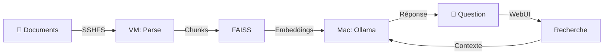

<div align="center">

# 📚 FAMILY RAG

### *La mémoire vivante de votre famille, accessible par l'IA sans connexion internet*

[](https://opensource.org/licenses/MIT)
[](https://www.python.org/)
[](https://flask.palletsprojects.com/)
[](https://ollama.ai/)
[](https://langchain.com/)
[](https://github.com/facebookresearch/faiss)
[](https://getfedora.org/)
[](https://www.apple.com/macos/)

*Interrogez en langage naturel l'histoire, les recettes, les documents administratifs et les cours de votre famille*

</div>

---

## 🎯 Pourquoi Family RAG ?

### Le problème

Chaque famille accumule au fil des années une **richesse documentaire** considérable :
- 📜 **Documents administratifs** : actes, contrats, factures, garanties
- 👨‍👩‍👧‍👦 **Histoire familiale** : lettres, biographies, photos légendées, arbres généalogiques
- 🍳 **Savoir-faire** : recettes de grand-mère, techniques artisanales, tours de main
- 📚 **Éducation** : cours des enfants, notes de révision, fiches méthodes
- 🏡 **Patrimoine** : plans, diagnostics, travaux, entretien maison

Cette **mémoire familiale** est souvent :
- ❌ Dispersée dans des tiroirs, classeurs, ordinateurs
- ❌ Inaccessible sans fouiller pendant des heures
- ❌ Perdue à la disparition de celui qui "savait où c'était"
- ❌ Non transmise aux générations futures

### La solution : FAMILY RAG

Un système **intelligent et privé** qui :
- ✅ **Centralise** tous vos documents en un seul endroit
- ✅ **Comprend** le sens de vos questions en langage naturel
- ✅ **Répond** en s'appuyant sur vos propres archives
- ✅ **Préserve** la mémoire familiale vectorisée pour les générations futures
- ✅ **Reste local** : aucune donnée ne quitte votre infrastructure

### Cas d'usage concrets

**📋 Administratif**
> *"Où est la garantie du lave-vaisselle acheté en 2019 ?"*
> 
> *"Quelle est la date d'échéance de l'assurance habitation ?"*

**👴 Histoire familiale**
> *"Raconte-moi l'histoire de l'arrière-grand-père pendant la guerre"*
> 
> *"Quand la maison familiale a-t-elle été construite ?"*

**🍲 Cuisine & savoir-faire**
> *"Comment grand-mère faisait-elle son bœuf bourguignon ?"*
> 
> *"Quelle est la technique pour bouturer les rosiers ?"*

**📖 Éducation enfants**
> *"Explique-moi la règle des participes passés vue en CM2"*
> 
> *"Résume le cours de SVT sur la photosynthèse"*

---

## 🏗️ Architecture

### Vue d'ensemble
```
┌────────────────────────────────────────────────────┐
│              ARCHITECTURE HYBRIDE                   │
│                                                     │
│  ╔══════════════════════╗     ╔═══════════════════╗│
│  ║   Mac M3 Pro (Hôte)  ║────▶║  VM Fedora 43     ║│
│  ╠══════════════════════╣     ╠═══════════════════╣│
│  ║  🤖 Ollama           ║     ║  🐍 Python RAG    ║│
│  ║  • Mistral LLM       ║     ║  • Langchain      ║│
│  ║  • Nomic Embeddings  ║     ║  • FAISS VectorDB ║│
│  ║                      ║     ║  • Flask WebUI    ║│
│  ║  📁 Documents RAG    ║◀────║  📂 SSHFS Mount   ║│
│  ║     ~/Documents/RAG  ║     ║     ~/RAG         ║│
│  ╚══════════════════════╝     ╚═══════════════════╝│
│                                                     │
│  Réseau privé : 172.16.74.0/24 (offline-ready)    │
└────────────────────────────────────────────────────┘
```

### Stack technologique

<div align="center">

| Composant | Technologie | Rôle |
|-----------|-------------|------|
| 🖥️ **Hôte** | macOS (M3 Pro) | Hébergement Ollama & documents |
| 🤖 **LLM** | Mistral 7B | Génération réponses |
| 🧠 **Embeddings** | Nomic Embed Text | Vectorisation sémantique |
| 🐧 **VM** | Fedora 43 | Traitement & indexation |
| 🐍 **Framework** | Langchain + FAISS | Pipeline RAG |
| 🌐 **Interface** | Flask + Socket.IO | WebUI temps réel |
| 🔗 **Partage** | SSHFS | Montage documents |
| 📦 **Formats** | 8 types | PDF, DOCX, TXT, MD, ODT, HTML, EPUB, EML |

</div>

### Flux de données


---

## ⚡ Installation en 5 scripts

Tout est automatisé. Exécutez simplement les scripts dans l'ordre :
```bash
# 1️⃣ Réseau privé Mac ↔ VM
./installation-reseau.sh

# 2️⃣ Création VM Fedora 43
./installation_fedora.sh

# 3️⃣ Configuration SSH bidirectionnelle
./configuration_ssh.sh

# 4️⃣ Installation Ollama + modèles sur Mac
./installation_ollama.sh

# 5️⃣ Déploiement RAG complet sur VM
./installation_rag.sh

# 🎁 Manager les services du RAG au complet depuis la machine hôte : 
./rag_manager.sh
```

**Durée totale : ~35 minutes** ⏱️

### Ce que fait chaque script

| Script | Fonction |
|--------|----------|
| `setup_network_mac.sh` | Configure l'interface réseau virtuelle (VMware/VirtualBox) |
| `setup_vm_fedora.sh` | Crée automatiquement la VM avec l'ISO Fedora |
| `setup_ssh.sh` | Génère et échange les clés SSH Mac ↔ VM |
| `setup_ollama.sh` | Installe Ollama, télécharge Mistral + Nomic, configure LaunchAgent |
| `setup_rag.sh` | Déploie Python, Langchain, FAISS, parsers et script RAG |

**Prérequis** : Mac (M1/M2/M3 ou Intel), VMware Fusion/VirtualBox, ISO Fedora 43

---

## 🚀 Utilisation

### Interface web (recommandée)
```bash
# Sur la VM
python ~/rag_webui.py

# Accéder à : http://VM_IP:5000
```

**Fonctionnalités** :
- 💬 Chat en temps réel avec l'assistant familial
- 📊 Métriques système (documents, chunks, requêtes)
- 📜 Historique complet avec export JSON
- ⚙️ Configuration avancée (modèles, température, k)
- 🔄 Indexation visuelle avec progression

### Ligne de commande
```bash
# Sur la VM
source ~/rag_env/bin/activate

# Indexer les documents
rag index

# Interroger
rag query "Ta question ici"
```

### Gestionnaire système
```bash
# Installer
sudo cp rag_manager.sh /usr/local/bin/rag-manage

# Démarrer tout
rag-manage start

# Statut complet avec diagnostics
rag-manage status

# Arrêter proprement
rag-manage stop

# Sauvegarder la base vectorielle
rag-manage backup
```

---

## 📦 Formats supportés

| Format | Extension | Cas d'usage |
|--------|-----------|-------------|
| Texte | `.txt` `.md` | Notes, transcriptions |
| PDF | `.pdf` | Scans, documents officiels |
| Word | `.docx` | Lettres, biographies |
| LibreOffice | `.odt` | Documents alternatifs |
| Web | `.html` `.htm` | Archives pages web |
| Email | `.eml` | Correspondances |
| Ebook | `.epub` | Livres numériques |

---

## 🛡️ Sécurité & Confidentialité

- ✅ **100% local** : Aucune donnée ne sort de votre infrastructure
- ✅ **Offline-ready** : Fonctionne sans Internet APRÈS installation
- ✅ **Réseau privé** : Communication Mac ↔ VM isolée
- ✅ **Pas de cloud** : Vos archives familiales restent privées
- ✅ **Open source** : Code auditable et modifiable

---

## 🗺️ Roadmap

- [ ] Support OCR pour documents scannés (Tesseract)
- [ ] Transcription audio des interviews familiales (Whisper)
- [ ] Timeline interactive des événements
- [ ] Export PDF des conversations
- [ ] Mode multi-utilisateurs
- [ ] Application mobile

---

## 🤝 Contribution

Les contributions sont les bienvenues ! Ce projet est né d'un **besoin personnel** de transmission intergénérationnelle et d'efficacité quotidienne.

- 🐛 **Bugs** : [Ouvrir une issue](https://github.com/liam4chilll/FAMILY_RAG/issues)
- 💡 **Idées** : [Démarrer une discussion](https://github.com/liam4chilll/FAMILY_RAG/discussions)
- 🔧 **Code** : Fork → Branch → PR

[Lire la licence complète →](LICENSE)

</div>

---

## 🙏 Remerciements

Construit avec des technologies open-source d'exception :

<div align="center">

[](https://ollama.ai/)
[](https://langchain.com/)
[](https://github.com/facebookresearch/faiss)
[](https://flask.palletsprojects.com/)
[](https://www.python.org/)

</div>

Merci à la communauté open-source qui rend ce type de projet possible ! 🌟

---

<div align="center">

### ⭐ Si ce projet résonne avec vous, donnez-lui une étoile !

**Fait avec ❤️ pour préserver et transmettre la mémoire familiale**

---

*"La mémoire est le parfum de l'âme." — George Sand*

---

[⬆ Retour en haut](#-FAMILY_RAG)

</div>
```

---

## 📄 LICENSE
```
MIT License

Copyright (c) 2024 FAMILY RAG Contributors

Permission is hereby granted, free of charge, to any person obtaining a copy
of this software and associated documentation files (the "Software"), to deal
in the Software without restriction, including without limitation the rights
to use, copy, modify, merge, publish, distribute, sublicense, and/or sell
copies of the Software, and to permit persons to whom the Software is
furnished to do so, subject to the following conditions:

The above copyright notice and this permission notice shall be included in all
copies or substantial portions of the Software.

THE SOFTWARE IS PROVIDED "AS IS", WITHOUT WARRANTY OF ANY KIND, EXPRESS OR
IMPLIED, INCLUDING BUT NOT LIMITED TO THE WARRANTIES OF MERCHANTABILITY,
FITNESS FOR A PARTICULAR PURPOSE AND NONINFRINGEMENT. IN NO EVENT SHALL THE
AUTHORS OR COPYRIGHT HOLDERS BE LIABLE FOR ANY CLAIM, DAMAGES OR OTHER
LIABILITY, WHETHER IN AN ACTION OF CONTRACT, TORT OR OTHERWISE, ARISING FROM,
OUT OF OR IN CONNECTION WITH THE SOFTWARE OR THE USE OR OTHER DEALINGS IN THE
SOFTWARE.
