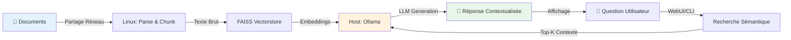

<div align="center">

# 📚 FAMILY RAG

### *La mémoire vivante de votre famille*

*Interrogez en langage naturel l'histoire, les recettes, les documents administratifs et les cours de votre famille accessible par l'IA et surtout SANS CONNEXION INTERNET !*

[](https://opensource.org/licenses/MIT)
[](https://www.python.org/)
[](https://ollama.ai/)
[](https://langchain.com/)
[](https://github.com/facebookresearch/faiss)

**Multi-plateforme** · **100% Local** · **Open Source** · **Zero Cloud**

</div>

---

## 🎯 Pourquoi Family RAG ?

Chaque famille accumule au fil des années une **richesse documentaire** considérable :

- 📜 **Documents administratifs** : actes, contrats, factures, garanties
- 👨‍👩‍👧‍👦 **Histoire familiale** : lettres, biographies, photos légendées, arbres généalogiques
- 🍳 **Savoir-faire** : recettes de grand-mère, techniques artisanales, tours de main
- 📚 **Éducation** : cours des enfants, notes de révision, fiches méthodes
- 🏡 **Patrimoine** : plans, diagnostics, travaux, entretien maison

**Family RAG** transforme cette bibliothèque en un système **intelligent et privé** qui :

- ✅ **Centralise** tous vos documents en un seul endroit
- ✅ **Comprend** le sens de vos questions en langage naturel
- ✅ **Répond** en s'appuyant sur vos propres archives
- ✅ **Préserve** la mémoire familiale vectorisée pour les générations futures
- ✅ **Reste local** : aucune donnée ne quitte votre infrastructure

---

## 💡 Cas d'usage concrets

<table>
<tr>
<td width="50%">

**📋 Administratif**
```
❓ "Où est la garantie du lave-vaisselle 
    acheté en 2019 ?"

❓ "Quelle est la date d'échéance de 
    l'assurance habitation ?"
```

**👴 Histoire familiale**
```
❓ "Raconte-moi l'histoire de 
    l'arrière-grand-père pendant la guerre"

❓ "Quand la maison familiale a-t-elle 
    été construite ?"
```

</td>
<td width="50%">

**🍲 Cuisine & savoir-faire**
```
❓ "Comment grand-mère faisait-elle 
    son bœuf bourguignon ?"

❓ "Quelle est la technique pour 
    bouturer les rosiers ?"
```

**📖 Éducation enfants**
```
❓ "Explique-moi la règle des participes 
    passés vue en CM2"

❓ "Résume le cours de SVT sur 
    la photosynthèse"
```

</td>
</tr>
</table>

---

## 🏗️ Architectures supportées

<div align="center">

| OS | Client RAG | Partage | Status |
|---------|------------|---------|--------|
| **Windows 11 (ARM)** | Linux (Fedora/Ubuntu) | **SMB** | ✅ Stable |
| **AppleSilicon** (M1/M2/M3) | Linux (Fedora) | **SSHFS** | ✅ Stable |

</div>

### Choisissez votre architecture

<table>
<tr>
<td width="50%" align="center">

### 🪟 Windows 11 ARM
**Recommandé pour :**
- Utilisateurs Windows natifs
- VMs sur VMware/Hyper-V/Parallels
- Infrastructure Windows existante

**Avantages :**
- ✅ Partage SMB natif
- ✅ Configuration pare-feu automatique
- ✅ Interface graphique complète

[📥 Windows 11 (ARM)](https://github.com/Liam4Chilll/FAMILY_RAG/tree/main/WINDOWS_11_ARM) 

</td>

<td width="50%" align="center">
    
### 🍎 Windows 11 x86-x64
**Recommandé pour :**
- Utilisateurs Windows 32bits & 64bit

**Avantages :**
- ✅ Accessible pour la majorité des systèmes actuels
- ✅ Partage SMB natif

[📥 Windows 10/11 - COMING SOON]()

</td>

<td width="50%" align="center">

### 🍎 MacOS (Apple Silicon)
**Recommandé pour :**
- Utilisateurs Mac M1/M2/M3/M4
- Performance optimale Apple Silicon
- Workflow macOS natif

**Avantages :**
- ✅ Optimisations ARM natives
- ✅ Montage SSHFS léger
- ✅ Intégration macOS fluide

[📥 AppleSilicon](https://github.com/Liam4Chilll/FAMILY_RAG/tree/main/APPLE_SILLICON) M1,M2,M3,M4

</td>
</tr>
</table>

---

## ⚡ Installation rapide

### Option 1 : Windows 11 ARM + Linux

#### 1️⃣ Setup Windows (Host Ollama)
```powershell
# Exécuter avec droits admin
.\install-llm-windows.ps1
```

**⏱️ Durée : ~10-15 min** (selon bande passante)

#### 2️⃣ Setup Linux (Client RAG)
```bash
# Rendre exécutable et lancer
chmod +x install-rag-fedora.sh
./install-rag-fedora.sh
```

**⏱️ Durée : ~15-20 min** (installation Python packages)

---

### Option 2 : macOS + Linux

#### 1️⃣ Setup macOS (Host Ollama)
```bash
# Rendre exécutable et lancer
chmod +x install-llm-macos.sh
./install-llm-macos.sh
```

#### 2️⃣ Setup Linux (Client RAG)
```bash
# Rendre exécutable et lancer
chmod +x setup-rag-vm.sh
./setup-rag-vm.sh
```

---

## 🎯 Utilisation

### Indexation des documents
```bash
# Activer l'environnement virtuel
source ~/rag_env/bin/activate

# Indexer tous les documents
~/rag_env/bin/rag index
```

### Interrogation CLI
```bash
# Poser une question
~/rag_env/bin/rag query "Votre question ici"
```

### Interface Web
```bash
# Lancer la WebUI
python ~/rag_webui.py

# Accès : http://your-linux-ip:5000
```

<div align="center">

*Interface web responsive accessible depuis tout appareil du réseau local*

</div>

---

## 🔧 Stack technologique

<div align="center">

| Composant | Technologies | Rôle |
|-----------|--------------|------|
| 🖥️ **Hôte Ollama** | macOS (M1/M2/M3) · Windows 11 ARM | Hébergement LLM & documents |
| 🤖 **LLM** | Mistral 7B · Llama 3 · Gemma 2 | Génération réponses contextuelles |
| 🧠 **Embeddings** | Nomic Embed Text · BGE-M3 | Vectorisation sémantique multilingue |
| 🐧 **Client RAG** | Fedora 40+ · Ubuntu 22.04+ · Debian 12+ | Traitement & indexation documents |
| 🐍 **Framework** | LangChain + FAISS | Pipeline RAG complet |
| 🌐 **Interface** | Flask + Socket.IO | WebUI temps réel responsive |
| 🔗 **Partage** | SSHFS (macOS) · SMB (Windows) | Montage réseau sécurisé |
| 📦 **Formats supportés** | 8 types | PDF, DOCX, TXT, MD, ODT, HTML, EPUB, EML |

</div>

### Flux de données


---

## 📋 Prérequis système

### Plateforme Ollama (Host)

<table>
<tr>
<td width="50%">

#### Windows 11 ARM
- Windows 11 ARM (build 22000+)
- 8 GB RAM minimum (16 GB recommandé)
- 20 GB espace disque libre
- Droits administrateur
- Réseau privé configuré

</td>
<td width="50%">

#### macOS Apple Silicon
- macOS 12.0+ (Monterey ou supérieur)
- Mac M1/M2/M3 (Apple Silicon)
- 8 GB RAM minimum (16 GB recommandé)
- 20 GB espace disque libre
- SSH activé (Préférences Système)

</td>
</tr>
</table>

### Client RAG (Linux)

- **Distributions supportées** : Fedora 38+, Ubuntu 22.04+, Debian 12+
- **Python** : 3.11+ (3.13 recommandé)
- **RAM** : 4 GB minimum (8 GB recommandé)
- **Disque** : 10 GB libres (hors documents)
- **Réseau** : Connectivité vers host Ollama (même subnet recommandé)

---

## 🛡️ Sécurité & Confidentialité

<div align="center">

| Garantie | Description |
|----------|-------------|
| ✅ **100% Local** | Aucune donnée ne quitte votre infrastructure |
| ✅ **Offline-ready** | Fonctionne sans Internet après installation |
| ✅ **Réseau privé** | Communication host ↔ client isolée |
| ✅ **Pas de cloud** | Vos archives familiales restent privées |
| ✅ **Open source** | Code auditable et modifiable (MIT License) |
| ✅ **Chiffrement** | Credentials stockés avec permissions 600 |
| ✅ **Pare-feu** | Règles limitées aux IPs spécifiques |

</div>

### Conformité RGPD

Family RAG est conçu pour respecter le RGPD par défaut :
- ✅ **Traitement local** : pas de transfert de données hors UE
- ✅ **Contrôle total** : vous êtes responsable de traitement
- ✅ **Droit à l'oubli** : suppression simple (rm -rf)
- ✅ **Portabilité** : données en formats ouverts

---

## 🐛 Troubleshooting

<details>
<summary><b>🪟 Windows : Ollama non accessible depuis réseau</b></summary>
```powershell
# Vérifier pare-feu
Get-NetFirewallRule -DisplayName "Ollama API"

# Tester localement
curl http://localhost:11434/api/tags

# Tester depuis réseau
curl http://YOUR_WINDOWS_IP:11434/api/tags
```

**Solutions :**
- Vérifier variable `OLLAMA_HOST=0.0.0.0:11434`
- Redémarrer Ollama : `Stop-Process -Name ollama; Start-Process ollama.exe serve`
- Vérifier règle pare-feu pour IP client Linux

</details>

<details>
<summary><b>🐧 Linux : Échec montage SMB/SSHFS</b></summary>

**SMB (Windows) :**
```bash
# Vérifier credentials
cat ~/.smbcredentials

# Test manuel
sudo mount -t cifs //windows-ip/RAG ~/RAG -o credentials=~/.smbcredentials

# Vérifier connectivité
nc -zv WINDOWS_IP 445
```

**SSHFS (macOS) :**
```bash
# Vérifier SSH
ssh USER@MACOS_IP "echo OK"

# Test manuel montage
sshfs USER@MACOS_IP:/path/to/documents ~/RAG
```

**Solutions :**
- Windows : Vérifier partage SMB actif (`Get-SmbShare`)
- macOS : Vérifier SSH activé (Préférences Système)
- Firewall : ports 445 (SMB) ou 22 (SSH) ouverts

</details>

<details>
<summary><b>🤖 Ollama : Modèles non téléchargés</b></summary>
```bash
# Lister modèles installés
ollama list

# Télécharger manuellement
ollama pull nomic-embed-text
ollama pull mistral:latest

# Vérifier espace disque
df -h

# Tester modèle
ollama run mistral:latest "Bonjour"
```

**Solutions :**
- Espace disque : libérer au moins 10 GB
- Réseau : vérifier connexion Internet lors téléchargement
- Timeout : augmenter timeout avec `OLLAMA_MAX_LOADED_MODELS=2`

</details>

<details>
<summary><b>🔍 Indexation : Erreurs FAISS</b></summary>
```bash
# Vérifier imports Python
source ~/rag_env/bin/activate
python -c "import faiss; print(faiss.__version__)"

# Réinstaller FAISS
pip install --force-reinstall faiss-cpu

# Vérifier documents accessibles
ls -lah ~/RAG/

# Supprimer index corrompu
rm -rf ~/faiss_index/
```

**Solutions :**
- Documents vides : vérifier montage réseau actif
- Permissions : `chmod -R 755 ~/RAG/`
- Version Python : utiliser Python 3.11+

</details>

<details>
<summary><b>🌐 WebUI : Port 5000 inaccessible</b></summary>
```bash
# Vérifier processus Flask
ps aux | grep rag_webui

# Tester localement
curl http://localhost:5000

# Vérifier pare-feu
sudo firewall-cmd --list-ports  # Fedora
sudo ufw status                  # Ubuntu

# Ouvrir port
sudo firewall-cmd --permanent --add-port=5000/tcp
sudo firewall-cmd --reload
```

**Solutions :**
- Bind address : vérifier `app.run(host='0.0.0.0', port=5000)`
- Firewall : autoriser port 5000 TCP
- Réseau : vérifier même subnet que client

</details>

---

## 📚 Documentation

- [📖 Guide d'installation complet](https://github.com/liam4chilll/FAMILY_RAG/wiki/Installation)
- [🔧 Configuration avancée](https://github.com/liam4chilll/FAMILY_RAG/wiki/Configuration)
- [🎨 Personnalisation WebUI](https://github.com/liam4chilll/FAMILY_RAG/wiki/WebUI)
- [🐛 FAQ & Troubleshooting](https://github.com/liam4chilll/FAMILY_RAG/wiki/FAQ)
- [📝 CHANGELOG](CHANGELOG.md) - Historique des versions

---

## 🗺️ Roadmap

### 🚀 Version 1.2.0 (Q1 2025)
- [ ] **Multi-sources** : Support Google Drive, Dropbox, OneDrive
- [ ] **Formats riches** : Images (OCR), Audio (transcription), Vidéos (sous-titres)
- [ ] **Recherche avancée** : Filtres par date, type, source
- [ ] **Export** : PDF des conversations avec citations
- [ ] **API REST** : Intégration applications tierces

### 🔮 Version 2.0.0 (Q2 2025)
- [ ] **Mode conversationnel** : Mémoire entre requêtes
- [ ] **Suggestions proactives** : "Autres questions similaires"
- [ ] **Annotations** : Tags manuels sur documents
- [ ] **Multi-utilisateurs** : Gestion permissions familiales
- [ ] **Mobile** : Application iOS/Android

### 💡 Idées communautaires
Votez pour les features sur [GitHub Discussions](https://github.com/liam4chilll/FAMILY_RAG/discussions) !

---

## 🤝 Contribution

Les contributions sont les bienvenues ! Ce projet est né d'un **besoin personnel** de transmission intergénérationnelle et d'efficacité quotidienne.

### Comment contribuer ?

1. **🐛 Reporter un bug** : [Créer une issue](https://github.com/liam4chilll/FAMILY_RAG/issues/new?template=bug_report.md)
2. **💡 Proposer une feature** : [Créer une discussion](https://github.com/liam4chilll/FAMILY_RAG/discussions/new)
3. **🔧 Contribuer du code** :
```bash
   # Fork le projet
   git clone https://github.com/YOUR_USERNAME/FAMILY_RAG.git
   cd FAMILY_RAG
   
   # Créer une branche
   git checkout -b feature/ma-super-feature
   
   # Commiter vos changements
   git commit -m "feat: ajouter support PostgreSQL"
   
   # Pousser et créer une Pull Request
   git push origin feature/ma-super-feature
```

### Guidelines

- ✅ Code commenté et documenté
- ✅ Tests unitaires pour nouvelles features
- ✅ Respect des conventions [Conventional Commits](https://www.conventionalcommits.org/)
- ✅ Update CHANGELOG.md

---

## 📄 Licence

Ce projet est sous licence **MIT** - voir [LICENSE](LICENSE) pour détails.

**En résumé :**
- ✅ Usage commercial et privé autorisé
- ✅ Modification et distribution autorisées
- ✅ Pas de garantie fournie
- ⚠️ Attribution requise

---

## 🙏 Remerciements

Family RAG s'appuie sur des technologies open-source exceptionnelles :

<div align="center">

[](https://ollama.ai/)
[](https://langchain.com/)
[](https://github.com/facebookresearch/faiss)
[](https://flask.palletsprojects.com/)
[](https://www.python.org/)

</div>

Merci à la communauté open-source qui rend ce type de projet possible !

---

## 💬 Support & Contact

- 📧 **Email** : liam4chilll@example.com
- 💬 **Discussions** : [GitHub Discussions](https://github.com/liam4chilll/FAMILY_RAG/discussions)
- 🐛 **Issues** : [GitHub Issues](https://github.com/liam4chilll/FAMILY_RAG/issues)
- 🐦 **Twitter** : [@liam4chilll](https://twitter.com/liam4chilll)

---

<div align="center">

### ⭐ Si ce projet vous est utile, donnez-lui une étoile !

**Family RAG est fait avec ❤️ pour préserver et transmettre la mémoire familiale**

[⬆ Retour en haut](#-family-rag)

</div>
