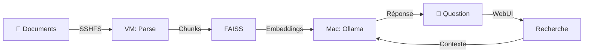

# 📚 FAMILY RAG

### *La mémoire vivante de votre famille*

*Interrogez en langage naturel l'histoire, les recettes, les documents administratifs et les cours de votre famille accessible par l'IA et surtout SANS CONNEXION INTERNET !*

---

## 🎯 Pourquoi Family RAG ?

Chaque famille accumule au fil des années une **richesse documentaire** considérable :

- 📜 **Documents administratifs** : actes, contrats, factures, garanties
- 👨‍👩‍👧‍👦 **Histoire familiale** : lettres, biographies, photos légendées, arbres généalogiques
- 🍳 **Savoir-faire** : recettes de grand-mère, techniques artisanales, tours de main
- 📚 **Éducation** : cours des enfants, notes de révision, fiches méthodes
- 🏡 **Patrimoine** : plans, diagnostics, travaux, entretien maison

Aujourd'hui je propose un système facilement déployable, **intelligent et privé** qui :

- ✅ **Centralise** tous vos documents en un seul endroit
- ✅ **Comprend** le sens de vos questions en langage naturel
- ✅ **Répond** en s'appuyant sur vos propres archives
- ✅ **Préserve** la mémoire familiale vectorisée pour les générations futures
- ✅ **Reste local** : aucune donnée ne quitte votre infrastructure

### Voici quelques cas d'usage concrets

**📋 Administratif**
> *"Où est la garantie du lave-vaisselle acheté en 2019 ?"*
> 
> *"Quelle est la date d'échéance de l'assurance habitation ?"*

**👴 Histoire familiale**
> *"Raconte-moi l'histoire de l'arrière-grand-père pendant la guerre"*
> 
> *"Quand la maison familiale a-t-elle été construite ?"*

**🍲 Cuisine & savoir-faire**
> *"Comment grand-mère faisait-elle son bœuf bourguignon ?"*
> 
> *"Quelle est la technique pour bouturer les rosiers ?"*

**📖 Éducation enfants**
> *"Explique-moi la règle des participes passés vue en CM2"*
> 
> *"Résume le cours de SVT sur la photosynthèse"*

### Stack technologique

| Composant | Technologie | Rôle |
|-----------|-------------|------|
| 🖥️ **Hôte** | macOS (M3 Pro) | Hébergement Ollama & documents |
| 🤖 **LLM** | Mistral 7B | Génération réponses |
| 🧠 **Embeddings** | Nomic Embed Text | Vectorisation sémantique |
| 🐧 **VM** | Fedora 43 | Traitement & indexation |
| 🐍 **Framework** | Langchain + FAISS | Pipeline RAG |
| 🌐 **Interface** | Flask + Socket.IO | WebUI temps réel |
| 🔗 **Partage** | SSHFS | Montage documents |
| 📦 **Formats** | 8 types | PDF, DOCX, TXT, MD, ODT, HTML, EPUB, EML |

### Flux de données

---

## ⚡ Installation en 2 scripts

# Machine hôte (IA + modèles)
./setup-macos.sh

# Machine virtuelle (RAG)
./setup-rag-vm.sh

Accès à la webUI : http://<VM_IP>:5000

## 🧹 Désinstallation

# Machine hôte
./cleanup-macos.sh

# Machine virtuelle
./cleanup-vm.

## 🛡️ Sécurité & Confidentialité

- ✅ **100% local** : Aucune donnée ne sort de votre infrastructure
- ✅ **Offline-ready** : Fonctionne sans Internet APRÈS installation
- ✅ **Réseau privé** : Communication Mac ↔ VM isolée
- ✅ **Pas de cloud** : Vos archives familiales restent privées
- ✅ **Open source** : Code auditable et modifiable

---

## 🗺️ Roadmap

- [ ] Interropérabilité Windows
- [ ] Prise en charge des formats JPEG, PNG, MP3, MP4
- [ ] Export PDF des conversations
- [ ] Au fil de l'eau..

---

## 🤝 Contribution

Les contributions sont les bienvenues ! Ce projet est né d'un **besoin personnel** de transmission intergénérationnelle et d'efficacité quotidienne.

- 🐛 **Bugs** : [Ouvrir une issue](https://github.com/liam4chilll/FAMILY_RAG/issues)
- 🔧 **Code** : Fork → Branch → PR

[Lire la licence complète →](LICENSE)

---

J'ai conçu Family RAG avec des technologies open-source :

Merci à la communauté open-source qui rend ce type de projet possible !

 Si ce projet résonne avec vous, donnez-lui une étoile ⭐ !

**Family RAG est fait avec ❤️ pour préserver et transmettre la mémoire familiale de chacun**

[⬆ Retour en haut](#-FAMILY_RAG)
